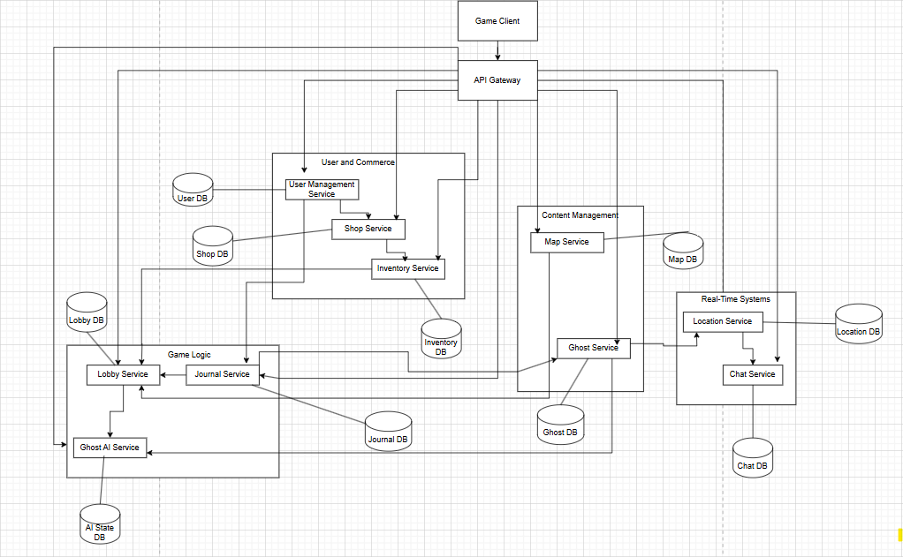

# Phasmophobia Clone - Microservices Architecture

## Overview

This document describes the service boundaries for a Phasmophobia clone game backend, designed to handle up to 4 million concurrent users through a microservices architecture.

## Service Boundaries

### 1. User Management Service

The User Management Service acts as the foundation of our platform, overseeing the entire lifecycle of user interactions and social functionalities. This service oversees all aspects from the initial authentication and authorization of users to the continual upkeep of user profiles, which encompasses email addresses, usernames, passwords, and player skill levels. 

In addition to fundamental profile management, it monitors in-game currency balances and enables the friend system that lets players connect with each other. The service also keeps user sessions active, guaranteeing secure and smooth gameplay experiences. All data pertaining to users, such as authentication tokens, friendships, and currency totals, is stored in this service's exclusive database, ensuring it remains entirely self-sufficient with its own business rules.

**Responsibility:** Complete user lifecycle management and social features

**Core Functions:**

- User authentication and authorization

- User profile management (email, username, password, level)

- In-game currency tracking and management

- Friend system implementation

- User session management

**Data Owned:** User profiles, authentication tokens, friend relationships, currency balances

**Independence:** Fully self-contained with its own database and business logic

---

### 2. Ghost AI Service

Central to our game's paranormal experience is the Ghost AI Service, responsible for all AI-driven ghost actions and fundamental game mechanics. This service handles the intricate states of ghost entities, deciding when they ought to conceal themselves from players, show up, or actively spook certain areas. 

The AI's decision-making considers multiple elements such as present map designs, difficulty options, and each player's sanity levels to generate engaging and tough situations. The service manages complex object interaction rules that enable ghosts to alter the game environment and employs sophisticated player targeting algorithms that generate tailored frightening experiences. 

Every ghost instance functions within its own thread or actor-based framework, guaranteeing separate processing and avoiding conflicts among various supernatural beings. The service retains full control over ghost AI states, behavioral patterns, and decision-making frameworks.

**Responsibility:** AI-driven ghost behavior and game mechanics

**Core Functions:**

- Ghost state management (hiding, showing, haunting)

- AI decision-making based on map data, difficulty, and player sanity

- Object interaction logic for ghosts

- Player targeting algorithms

- Thread/Actor-based ghost instance management

**Data Owned:** Ghost AI states, behavior patterns, decision trees

**Independence:** Separate processing units per ghost instance, isolated AI logic


---

### 3. Shop Service

The Shop Service offers extensive e-commerce features for all purchases and transactions within the game. This service upholds a comprehensive inventory of accessible products, featuring thorough descriptions, titles, and durability evaluations for each item. A highly advanced feature is the dynamic pricing system that modifies item prices according to different market influences and player actions. 

The service monitors full price histories, enabling trend analysis and educated buying choices. Every transaction is handled within this service, guaranteeing secure and dependable purchasing experiences. The store keeps a separate product database featuring full commerce functionality, functioning autonomously from other system elements while overseeing item catalogs, pricing information, price histories, and transaction logs.

**Responsibility:** E-commerce functionality for in-game items

**Core Functions:**

- Item catalog management (title, description, durability)

- Dynamic pricing system

- Price history tracking

- Purchase transaction processing

**Data Owned:** Item catalog, pricing data, price history, transaction records

**Independence:** Self-contained commerce logic with own product database

---

### 4. Journal Service

The Journal Service executes the player monitoring and documentation system that constitutes an essential element of the gaming experience. Gamers utilize this service to document paranormal signs they witness while playing, formulate informed theories about ghost varieties based on their findings, and get accuracy ratings that influence currency bonuses. 

The service offers detailed post-game analysis options enabling players to contrast their observations with real ghost behaviors and gain insights from their experiences. This establishes a cycle of learning that enhances player abilities gradually. The journal system functions with total data separation, preserving its own storage for player observations, ghost encounter logs, and accuracy measurements.

**Responsibility:** Player observation and recording system

**Core Functions:**

- Symptom recording and tracking

- Ghost type guessing mechanism

- Accuracy scoring and currency reward calculation

- Post-game analysis and comparison

**Data Owned:** Player observations, ghost encounters, accuracy metrics

**Independence:** Isolated recording system with own data storage


---

### 5. Lobby Service

The Lobby Service coordinates game sessions and oversees essential gameplay state data. This service establishes and oversees ongoing game sessions, monitoring crucial player conditions such as sanity levels and death status during matches. It manages the intricate logic of item allocation, monitoring which player possesses which items at any moment. 

The service also handles adjustments for difficulty levels and determines map choices and ghost type allocations for every game session. All data specific to the session, such as ongoing games, player statuses, and assigned items, is handled by the lobby's dedicated persistence layer, guaranteeing game integrity and uniform state management.

**Responsibility:** Game session coordination and state management

**Core Functions:**

- Game session creation and management

- Player sanity level tracking

- Death status monitoring

- Item distribution and holder tracking

- Difficulty level management

- Map and ghost type assignment

**Data Owned:** Active game sessions, player states, item assignments

**Independence:** Session-specific data management with own persistence layer


---


### 6. Map Service

The Map Service manages every element of dynamic environment generation and maintenance in our game universe. This service offers extensive instruments for designing homes and distinct areas, overseeing the interactions between various rooms, and positioning items within the setting. A significant aspect is the capability to randomize object locations and assign concealment spots, resulting in diverse experiences even on well-known maps. 

The service enables custom map creation, facilitating distinctive designs and setups. All data related to maps, such as layout designs, room arrangements, and algorithms for placing objects, are stored in the service's internal database and generation systems.

**Responsibility:** Dynamic environment creation and management


**Core Functions:**

- House and room creation tools

- Room connectivity management

- Object placement and shuffling

- Hiding place designation

- Custom map generation


**Data Owned:** Map layouts, room configurations, object placements

**Independence:** Self-contained map data with generation algorithms


---

### 7. Ghost Service


The Ghost Service operates as an all-encompassing encyclopedia and behavioral classification system for every supernatural being in the game. This service keeps comprehensive records of various ghost categories, featuring Type A symptoms observable by players and Type B symptoms that signify concealed behavioral trends accessible solely by AI systems. 

The service outlines the essential traits of every ghost type, supplying reference information that other services utilize to craft genuine supernatural encounters. All information about ghosts, such as behavioral guidelines, symptom descriptions, and defining traits, is stored in the specialized knowledge base of this service.


**Responsibility:** Ghost encyclopedia and behavioral definitions

**Core Functions:**

- Ghost type catalog management

- Type A symptoms (visible to players)

- Type B symptoms (hidden behavioral patterns)

- Ghost characteristic definitions


**Data Owned:** Ghost encyclopedia, symptom definitions, behavioral rules

**Independence:** Reference data service with own ghost knowledge base


---

### 8. Location Service

The Location Service offers live tracking of player locations and activities across the game environment. This service observes player movement between rooms, records occupancy levels, and tracks all interactions with items as they happen. It stays conscious of social situations, recognizing when individuals are solitary or in crowds and if they are talking or staying silent. 

The service monitors visibility status and provides timestamped updated data to guarantee that all location details stay current and precise. All data regarding player locations, interaction records, and movement histories are stored in the service's dedicated real-time tracking database.

**Responsibility:** Real-time player position and interaction tracking


**Core Functions:**

- Player movement tracking

- Room occupancy monitoring

- Item interaction logging

- Social context tracking (alone/group, speaking/quiet)

- Visibility status management

- Timestamp-based fresh data serving


**Data Owned:** Player locations, interaction logs, movement history

**Independence:** Real-time tracking system with own location database

---

### 9. Inventory Service

The Inventory Service oversees the entire lifecycle of item ownership and condition monitoring. This service keeps thorough records of item ownership among players, tracks full purchase histories, and observes item durability as it diminishes with use. The service enables players to exchange items during gameplay and maintains precise ownership records consistently. 

All ownership records, purchase logs, and item condition details are kept within the service's exclusive storage system, ensuring total separation from other system elements.

**Responsibility:** Item ownership and lifecycle management


**Core Functions:**

- Item ownership tracking

- Purchase history management

- Durability monitoring

- Item transfer between players

**Data Owned:** Ownership records, purchase history, item conditions

**Independence:** Self-contained inventory management with own storage

---

### 10. Chat Service

The Chat Service allows players to communicate in real-time via various channels and methods. The service offers location-based text messaging for players in the same area to interact, along with radio communication systems that facilitate wider team coordination. The service utilizes advanced proximity-based chat regulations that decide who can receive which messages according to player locations. 

In supernatural occurrences, the service may implement haunting-related communication limits that introduce extra gameplay obstacles. All chat messages, communication records, and channel statuses are preserved within the service's dedicated messaging storage system.

**Responsibility:** Real-time communication system

**Core Functions:**

- Room-based text messaging

- Radio communication system

- Proximity-based chat rules

- Haunting-based communication restrictions


**Data Owned:** Chat messages, communication logs, channel states

**Independence:** Real-time messaging system with own message storage

---

## Service Communication Requirements

The structure demands varying degrees of communication among services based on their functional interactions. The most frequent exchanges happen between the Lobby Service and Ghost AI Service, which require ongoing game state updates to ensure synchronized gameplay experiences. In the same way, the Location Service keeps ongoing communication with the Ghost AI Service to deliver real-time player location data that aids AI decision-making. The Location Service and Chat Service regularly interact to implement messaging rules based on proximity.

Multiple service pairs need a moderate degree of communication to operate efficiently. The User Management Service checks currency availability with the Shop Service during purchase attempts, whereas the Shop Service works with the Inventory Service to finalize purchases and transfer ownership. The Lobby Service receives updates from the Inventory Service regarding changes in item usage and durability, while the Journal Service confirms ghost type details with the Ghost Service to ensure precise scoring.

Certain communications occur less often yet continue to be crucial for system operation. The Map Service delivers layout details to the Lobby Service during the setup of game sessions, whereas the Ghost Service offers behavioral guidelines to the Ghost AI Service when required. The Journal Service sends currency reward details to the User Management Service according to player performance.

### High-Frequency Communication Pairs

- Lobby Service ↔ Ghost AI Service: Continuous game state updates

- Location Service ↔ Ghost AI Service: Real-time player position data

- Location Service ↔ Chat Service: Proximity-based messaging rules

- Lobby Service ↔ Location Service: Player state synchronization


### Moderate-Frequency Communication

- User Management Service ↔ Shop Service: Currency validation for purchases

- Shop Service ↔ Inventory Service: Purchase completion and ownership transfer

- Inventory Service ↔ Lobby Service: Item usage and durability updates

- Journal Service ↔ Ghost Service: Ghost type validation and scoring


### Low-Frequency Communication

- Map Service ↔ Lobby Service: Map selection for game sessions

- Ghost Service ↔ Ghost AI Service: Behavioral rule retrieval

- User Management Service ↔ Journal Service: Currency rewards distribution


---


## Scalability Considerations

very service in this architecture is created to function autonomously and scale based on requirements. This method enables separate parts to manage different loads without affecting the overall system. The services ensure data consistency by employing eventual consistency patterns, understanding that immediate consistency across all systems is secondary to preserving system availability and performance. 

Circuit breaker patterns safeguard against cascading failures when specific services encounter issues, guaranteeing that short-term problems in one area do not incapacitate the whole platform. The design enables horizontal scaling to meet our goal of more than four million simultaneous users, allowing each service to add extra instances when necessary to manage higher demand.

# Technologies and Communication Patterns

## Technology Stack Distribution

our platform utilizes three unique technology stacks, each tailored to meet particular service needs and business goals. This strategic allocation guarantees that every element functions at optimal efficiency while preserving the overall unity of the system.


### C#/.NET: The Robust Enterprise Foundation

Our infrastructure will be built on \*\*C# 12 with .NET 8\*\*, supporting essential services such as \*\*Location Service, Ghost AI Service, Lobby Service, User Management Service, Shop Service, and Inventory Service\*\*.

These services will be developed with \*\*ASP.NET Core\*\* for strong Web APIs, \*\*SignalR\*\* for instant communication, and \*\*Entity Framework Core\*\* for smooth database interactions. SQL will act as the database. All processes operate within containers using Docker.

**Business Justification:**

- .NET 8's advanced async/await model manages 4M+ concurrent users effectively with low thread overhead.

- High performance with reduced memory usage, essential for ghost AI and location tracking.

- ASP.NET Identity provides complete authentication and authorization for enterprise-level security.

- Strong typing prevents runtime errors in financial operations and game mechanics.

- SignalR provides outstanding WebSocket support for location updates and AI changes.

- Single language/framework across critical services reduces context switching for developers.

---

### JavaScript/Node.js: Outstanding Real-Time Communication


Our **Chat Service and Map Service** operate on **Node.js 20+ with TypeScript**, using **Express.js** and **Socket.IO** frameworks. These services connect to a database and run in Docker containers.


**Business Justification:**

- Socket.IO delivers high performance for real-time messaging and chat.

- Native JSON handling is ideal for map setups and dynamic content.

- Event-driven architecture efficiently handles chat and map events.

- Rapid development cycles allow fast improvements.

- Node.js is industry standard for bidirectional WebSocket communication.

---

### Python: Information Analysis and Content Administration


Our **Journal Service and Ghost Service** utilize **Python with FastAPI**, running within Docker and Kubernetes.


**Business Justification:**

- Excellent data handling and analysis tools.

- Strong in examining player behavior trends, ghost data, and scoring accuracy.

- Great for managing complex ghost encyclopedia content and categorization systems.

- Integrated machine learning improves ghost AI and player analytics.

- Fast prototyping speeds up feature development.

- Strong statistical libraries enhance scoring and observation analysis.


---


### Multi-Language Strategy


This multi-language approach guarantees that every service functions in its **optimal environment** while ensuring smooth integration through containerization and orchestration.


---


## Patterns of Communication and Infrastructure Strategy


Our platform employs three communication patterns, each optimized for specific interactions: synchronous, asynchronous, and real-time.


### Synchronous Communication: Instantaneous Reply Structure


Used for immediate responses via **HTTP and gRPC**.


**Examples:**

- User Management ↔ Shop Service (authentication, currency checks)

- Shop Service ↔ Inventory Service (purchase verification)

- Journal Service ↔ Ghost Service (ghost type queries)

- Location Service ↔ Ghost AI Service (position queries)

- Map Service ↔ Lobby Service (session data)


**Technology Implementation:**

- External APIs → REST over HTTPS

- Internal C# services → ASP.NET Core HTTP + gRPC

- Node.js services → Express.js HTTP APIs

- Python services → FastAPI HTTP APIs

- Nginx + Consul → Load balancing \& service discovery


---


### Asynchronous Interaction: Event-Focused Excellence


Event-driven communication via **message queues**, ensuring responsiveness.


**Examples:**

- Lobby → Ghost AI (game state events)

- Location → multiple services (position updates)

- Shop → User Management (currency updates)

- Inventory → Lobby (item usage events)

- Ghost AI → Location (environment changes)

- Journal → Ghost Service (analytics)


**Technology Implementation:**

- C# services → Apache Kafka + MassTransit

- Node.js services → Redis Pub/Sub

- Python services → Celery + Redis

- Event sourcing ensures state integrity, CQRS optimizes operations


---


### Real-Time Communication: Live Gaming Experience


WebSocket-based connections for **instant feedback**.


**Examples:**

- Chat Service ↔ Clients (continuous chat streams)

- Location Service ↔ Players (SignalR updates)

- Ghost AI ↔ Lobby ↔ Map Service (real-time game updates)


**Technology Implementation:**

- Node.js → Socket.IO

- C# → SignalR (enterprise-grade WebSocket)

- Redis backplane → Broadcast across instances

- SignalR groups \& Socket.IO rooms → Lobby-based targeting


---


## Data Storage Approach: Multi-Database Structure


### Real-Time Data Handling


**Redis** as high-speed data layer for sessions, temporary states, SignalR/Socket.IO backplanes, and caching.


- C# → StackExchange.Redis

- Node.js → ioredis

- Python → redis-py


### Transactional Data Consistency


**PostgreSQL** for financials, profiles, transactions, analytics (ACID compliance).


- C# → Entity Framework Core (migrations)

- Python → SQLAlchemy + Alembic


### Document Data Adaptability


**MongoDB** for flexible schemas: game assets, user data, ghost encyclopedia.


- Node.js → Mongoose ODM

- Python → Motor (async) / PyMongo (standard)


---


## Strategic Choices and Organizational Alignment


### Balance Between Performance and Development Speed


- C# → High performance \& reliability for core systems

- Node.js → Fast development for real-time features

- Python → Quick prototyping \& powerful analytics


\### Decisions on Consistency vs Availability


- Financial data → Strong consistency (PostgreSQL ACID)

- Game state → Eventual consistency acceptable

- Real-time features → Prioritize availability (chat, location)


### Optimization of Cost vs Scalability


- .NET 8 → Memory efficiency reduces server costs

- Node.js \& Python → Faster delivery for specialized features

- Open-source stack → Enterprise-grade without licensing costs

## Architecture Diagram



The Game Client communicates through a centralized API Gateway that manages interactions between three main service clusters. The User & Commerce domain forms a tightly integrated group where the User Management Service, Shop Service, and Inventory Service work together through their respective databases to handle player authentication, transactions, and asset management. The Content Management cluster operates somewhat independently, with the Map Service managing game world data and the Ghost Service handling gameplay recordings or AI opponents, both feeding into a shared Ghost DB. The Real-Time Systems domain handles live gameplay through the Location Service and Chat Service with their dedicated databases. The Lobby Service acts as a central coordination hub, interfacing with multiple services including the Ghost AI Service, which uniquely bridges different domains by connecting to both the Journal Service (for event logging) and various gameplay services. The Journal Service serves as a cross-cutting logging system that captures events from the game logic layer, creating an audit trail that spans multiple service boundaries. This architecture demonstrates loose coupling between service domains while maintaining necessary data consistency through dedicated databases and careful service-to-service communication patterns.


## Communication Contract & Data Management

## 1. Architecture Overview

The game is designed as a **microservice architecture**, where each service has a clearly defined responsibility:

| Service | Language | Responsibility |
|---------|---------|----------------|
| User Management | C#      | Store user info (email, username, password, level, currency), manage friends |
| Ghost AI | C#      | Manage ghost behavior per lobby, relay ghost state to Game Service |
| Shop | Node.js | Display items, track prices and price history |
| Journal | Node.js | Record ghost sightings and player observations |
| Lobby | C#      | Manage active game sessions, including players, sanity, items, ghost type, map |
| Map | C#      | Define houses, rooms, object placement, and hiding spots |
| Ghost | Node.js | Store ghost encyclopedia, symptoms (Type A/B) |
| Location | Node.js | Track player movement, room presence, and interaction |
| Inventory | Python  | Track object ownership, purchase history, durability |
| Chat | Python  | Handle user-to-user communication in rooms or via radios |

---

## 2. Data Management Strategy

Each service is **self-contained with its own database**, following the **Database per Service** pattern:

- **Databases:**
    - User Management: SQL (users, friends)
    - Ghost AI: Redis (fast ghost state updates per lobby)
    - Shop: SQL (items, prices, price history)
    - Journal: SQL (user records, ghost observations)
    - Lobby: SQL (sessions, player states, items, ghost type, map)
    - Map: SQL (rooms, houses, objects, hiding places)
    - Ghost: SQL (ghost encyclopedia, symptoms)
    - Location: SQL (real-time player movement logs)
    - Inventory: SQL (item ownership, durability, purchase history)
    - Chat: SQL (message history, room presence)

- **Data Isolation:** Each service owns and manages its own data. No other service directly modifies its database.

- **Caching:** For high-frequency updates (Ghost AI, Location), a distributed cache (e.g., Redis) may be used to reduce database load.

---

## 3. Communication Between Services

Services communicate via **RESTful APIs and asynchronous messaging**:

### 3.1 Synchronous Communication (REST API)
- Services expose REST APIs for queries or updates that require immediate responses.
- Examples:
    - **Inventory Service** API to check item ownership by a user.
    - **Shop Service** API to fetch current item list and prices.
    - **User Management Service** API to fetch friend list or user level.

### 3.2 Asynchronous Communication (Message Broker)
- Use a **message broker** (e.g., RabbitMQ, Kafka) for events that can be processed asynchronously.
- Examples:
    - Lobby Service publishes **player joined/left** events → Ghost AI and Location Service consume.
    - Ghost AI publishes **ghost state updates** → Lobby Service subscribes to update player visibility.
    - Inventory updates (item bought, durability changed) → Journal and Lobby Services consume.
    - Chat messages can be broadcast via pub/sub channels to relevant users in the same room.

---

## 4. Data Flow Examples

### 4.1 Buying an Item
1. User requests an item purchase via **Shop Service**.
2. Shop Service validates the purchase and publishes an **ItemPurchased** event.
3. **Inventory Service** consumes the event → records ownership, durability, and purchase price.
4. **Lobby Service** consumes the event → adds item to active session if the user is in a lobby.

### 4.2 Player Movement
1. Player moves to a new room → **Location Service** records timestamped location.
2. Location Service publishes **PlayerMoved** event.
3. **Chat Service** uses this info to route messages only to users in the same room.
4. **Ghost AI Service** uses this info to decide potential targets for haunting.

### 4.3 Ghost Action
1. Ghost AI decides to move or interact → publishes **GhostAction** event.
2. **Lobby Service** updates the session state.
3. **Location** and **Inventory Services** may consume the event if an object is affected.

---

## 5. API Contracts

### 5.1 User Management API (example)
- `GET /users/{id}` → returns user info
- `POST /users/{id}/friends` → add a friend
- `GET /users/{id}/friends` → get friend list

### 5.2 Shop API (example)
- `GET /items` → returns list of items with current prices
- `GET /items/{id}/history` → returns price history
- `POST /items/{id}/purchase` → attempts purchase

### 5.3 Lobby API (example)
- `GET /lobbies/{id}` → fetch current session state
- `POST /lobbies/{id}/join` → add player to session
- `POST /lobbies/{id}/leave` → remove player from session

*(Similar contracts exist for other services; all events published to the message broker follow a consistent JSON schema.)*

---

## 6. Event Schema Example

```json
{
  "eventType": "ItemPurchased",
  "timestamp": "2025-09-08T13:00:00Z",
  "payload": {
    "userId": "123",
    "itemId": "safety_camera",
    "price": 500,
    "lobbyId": "lobby_45"
  }
}
```
---


# Service Endpoints & Communication Contract

Our platform defines a clear set of service endpoints that enable seamless communication between game systems, ensuring synchronized gameplay and consistent data flow.

These endpoints specify the **paths, request formats, and response structures** used by each service, covering **REST, gRPC, and WebSocket interactions**.

By standardizing inputs and outputs, we guarantee reliable integration across services while maintaining flexibility for future scaling and feature expansion.

---

## User Management Service
Handles user profiles, authentication, and currency.  
**Database:** PostgreSQL  

### Endpoints

#### POST /users/register

**Request**
```json
{
  "username": "string",
  "email": "string",
  "password": "string"
}
```
**Response**
```json
{
  "userId": "uuid",
  "createdAt": "timestamp"
}
```
#### POST /users/login

**Request**
```json
{
 "email": "string",
  "password": "string"
}
```
**Response**
```json
{
 "token": "jwt",
  "expiresIn": 3600
}
```
#### GET /users/{id}/balance

**Response**
```json
{
 "userId": "uuid",
  "currency": "int"
}
```
## Shop Service
Handles purchases, pricing, and transactions.
**Database:** PostgreSQL  

### Endpoints

#### POST /shop/purchase

**Request**
```json
{
  "userId": "uuid",
  "itemId": "uuid"
}
```
**Response**
```json
{
  "transactionId": "uuid",
  "status": "success|failed",
  "reason": "string|null"
}
```
#### GET /shop/items
**Response**
```json
[
  {
    "itemId": "uuid",
    "name": "string",
    "price": "int"
  }
]
```
## Inventory Service
Tracks owned items and durability.
**Database:** PostgreSQL  

### Endpoints

#### GET /inventory/{userId}
**Response**
```json
[
  {
    "itemId": "uuid",
    "name": "string",
    "durability": "float"
  }
]
```
#### POST /inventory/use
**Request**
```json
{
  "userId": "uuid",
  "itemId": "uuid"
}
```
**Response**
```json
{
  "status": "success|failed",
  "updatedDurability": "float|null"
}
```
## Lobby Service
Manages sessions, players, and game state.
**Database**  Redis (real-time), PostgreSQL (persistent logs)

### Endpoints

#### POST /lobby/create

**Request**
```json
{
  "hostId": "uuid",
  "mapId": "uuid"
}
```
**Response**
```json
{
  "lobbyId": "uuid",
  "status": "created"
}
```
#### POST /lobby/{lobbyId}/join

**Request**
```json
{
  "userId": "uuid"
}
```
**Response**
```json
{
  "status": "joined",
  "players": ["uuid", "uuid"]
}
```
## Location Service
Tracks player movements.
**Database**  Redis (real-time cache)

### Endpoints

#### POST /location/update
**Request**
```json
{
  "userId": "uuid",
  "x": "float",
  "y": "float",
  "z": "float"
}
```
**Response**
```json
{
   "status": "updated",
  "timestamp": "timestamp"
}
```
## Ghost AI Service
Handles ghost behavior logic.
**Database**  Redis (real-time), PostgreSQL (logs)

### gRPC Endpoints (Protobuf)

#### POST /location/update

**service GhostAI**
{
  rpc UpdateLocation (LocationUpdate) returns (Ack);
  rpc GetGhostState (GhostRequest) returns (GhostState);
}
**message LocationUpdate**

{
  string userId = 1;
  float x = 2;
  float y = 3;
  float z = 4;
}

**message GhostState**
{
  string ghostId = 1;
  string behavior = 2;
  float aggressionLevel = 3;
}


## Chat Service  

Handles real-time communication with proximity rules.  
**Transport:** WebSocket (Socket.IO)  

### Events  

**join_room**  
```json
  {
    "lobbyId": "uuid",
    "userId": "uuid"
  }
```

**send_message**  
```json
{
  "from": "uuid",
  "to": "uuid|null",
  "message": "string"
}
```
**receive_message**  
```json
{
  "from": "uuid",
  "message": "string",
  "timestamp": "timestamp"
}
```
## Journal Service
Manages ghost identification and scoring.
**Database**   MongoDB (ghost data), PostgreSQL (scores)

### Endpoints

#### POST /journal/submit
**Request**
```json
{
  "userId": "uuid",
  "lobbyId": "uuid",
  "ghostType": "string"
}
```
**Response**
```json
{
  "status": "recorded",
  "correct": "bool",
  "reward": "int"
}
```
## Map Service
Handles layout and environmental assets.
**Database**   MongoDB

### Endpoints

#### GET /maps/{mapId}

**Response**
```json
{
  "mapId": "uuid",
  "name": "string",
  "layout": "json"
}
```
## Ghost Service
Stores and provides detailed information about ghost types, symptoms, and behavioral rules.
**Database**   MongoDB (ghost encyclopedia), PostgreSQL (symptom usage logs)

### Endpoints

#### GET /ghosts

**Response**
```json
[
  {
    "ghostId": "uuid",
    "name": "string",
    "typeASymptoms": ["string", "string"],
    "typeBSymptoms": ["string", "string"]
  }
]
```
#### GET /ghosts/{ghostId}

**Response**
```json
{
  "ghostId": "uuid",
  "name": "string",
  "description": "string",
  "typeASymptoms": ["string", "string"],
  "typeBSymptoms": ["string", "string"]
}
```
#### POST /ghosts/validate

**Request**
```json
{
  "ghostId": "uuid",
  "submittedSymptoms": ["string"]
}
```
**Response**
```json
{
  "isMatch": "bool",
  "confidence": "float"
}
```

## GitHub Workflow Setup  

Our repository follows a structured GitHub workflow to ensure quality and collaboration.  

### Branching Strategy  
- **main**: Stable production-ready branch.  
- **development**: Integration branch for features before release.  
- **feature/***: Used for new features (e.g., `feature/chat-service`).  
- **bugfix/***: Used for bug fixes.  
- **hotfix/***: Used for urgent fixes in production.  

### Merging Strategy  
- We use **Squash and Merge** for a clean commit history.  
- Only merge via PRs; direct pushes to `main` or `development` are not allowed.  

### Pull Request Guidelines  
- All changes must go through a PR before merging.  
- Include a clear description of the changes and reference any related issues.  
- Ensure all tests and status checks pass before merging.  

### Test Coverage  
- Automated tests run on each PR using GitHub Actions.  
- A PR cannot be merged unless tests pass successfully.  

### Versioning  
- We follow **Semantic Versioning (SemVer)**: `MAJOR.MINOR.PATCH`.  
- New releases are tagged in GitHub (e.g., `v1.0.0`).  

